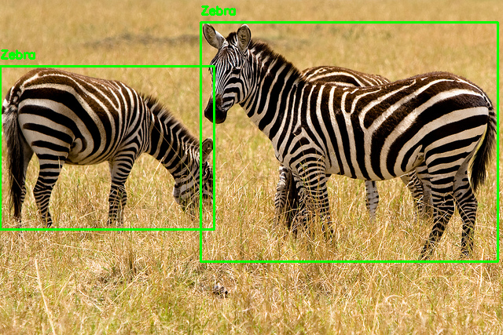

# YOLO to PASCAL VOC

This repository contains python scripts for converting YOLO formats to Pascal VOC format. There are scripts to verify the conversion. You can also visualize both YOLO and PASCAL VOC annotations with the provided codes.

##### Sample images with YOLO and PASCAL VOC bboxes
<table>
  <tr>
    <td> </td>
    <td> </td>
   </tr> 
   <tr>
      <td> <p align="center"> YOLO annotation </p> </td>
      <td> <p align="center"> PASCAL VOC annotation </p> </td>
  </tr>
</table>

### Usage

For converting YOLO annotations to PASCAL VOC format
```
python yolo-to-voc.py
```
To visualize your YOLO annotation's bounding box
```
python yolo-visualize.py
```
To visualize your PASCAL VOC annotation's bounding box
```
python voc-visualize.py
```
To just validate your conversion:
```
python validate-conversion.py
```
